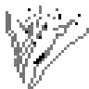

**文章遵从 “署名-非商业性使用-禁止演绎” 协议**
[CC BY-NC-ND 4.0](https://creativecommons.org/licenses/by-nc-nd/4.0/deed.zh)

---
### Top

#### [单词表](./notes/noteWords.md)
#### [Unity游戏优化](./books/Unity2017GameOptimization.md)
#### [C#多线程编程实战](./books/cSharpMultiThreadCookbook.md)

 

#### [剑与电 角色扮演游戏设计艺术](./books/SwordsAndCircuitry.md)
#### [体验引擎 游戏设计指南](./books/EngineeringExperiences.md)

 

#### [面向对象的游戏开发](./books/objectOrientedGameDevelopment.md)
#### [游戏人工智能编程案例精粹](./books/programmingGameAiByExample.md)
#### [UE4游戏编程入门](./books/samsTeachYourselfUnreal.md)

---
### Reading

#### [游戏编程模式](./books/gameProgrammingPatterns.md)
#### [3D数学基础 图形和游戏开发](./books/3DMathPrimer.md)
#### [Shader开发实战](./books/practicalShaderDevelopment.md)
#### [UnityShaderlab新手宝典](./books/unityShaderlabBeginner.md)

 

#### [学习Vi和Vim编辑器](./books/learningTheViAndVim.md)
#### [ProGit](./books/proGit.md)
#### [Vim实用技巧](./index.md)
#### [VsCode 权威指南](./books/vscodeLearn.md)

---
### Read

#### [C++17代码整洁之道](./books/cleanCplusplus.md)
#### [软件开发者路线图 从学徒到高手](./books/apprenticeshipPatterns.md)

 

#### [游戏开发的数学和物理](./books/physicsMathematicsSkills.md)
#### [游戏AI开发实用指南](./books/practicalGameAIProgramming.md)
#### [Unity人工智能游戏开发](./books/unityAiGameProgv2.md)
#### [Unity3D人工智能编程精粹](./books/unity3dAIprogramming.md)
#### [网络多人游戏架构与编程](./books/multiplayerGameProgramming.md)
#### [Unity3D网络游戏实战](./books/multiplayerGameDevWithUnity.md)
#### [C# and Shader Tutorials](./books/csharpAndShaderTutorials.md)

 

#### [SFML Essential](./books/sfmlEssential.md)
#### [Android第一行代码](./books/firstCodeForAndroid.md)

---
### Doc

#### [Rust 环境搭建](./notes/docRustup.md)
#### [Leiningen 参考](./notes/docLeiningen.md)
#### [Markdown语法](./notes/docMarkdown.md)
#### [Aseprite文档](./notes/docAseprite.md)

 

#### [Awesome-Gamedev](./notes/recordGamedev.md)
#### [pico-8精彩代码解析](./notes/recordPico8.md)
#### [A different kind of C#](./notes/recordBepuv2.md)
#### [算法笔记](./notes/noteAlgo.md)
#### [代码笔记](./notes/noteCodes.md)
#### [笔记本](./notes/noteMine.md)

 

#### [Unity DOTS 参考](./notes/unityEcs.md)
#### [Unity DOTS 文档](./notes/unityDots.md)
#### [Unity InputSystem](./notes/unityInputSystem.md)
#### [Dotween 文档](./notes/docDotween.md)
#### [ReSharper 快捷键](./notes/docReSharper.md)
#### [Unity Doc 笔记](./notes/unityDoc.md)